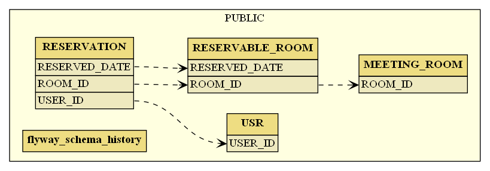
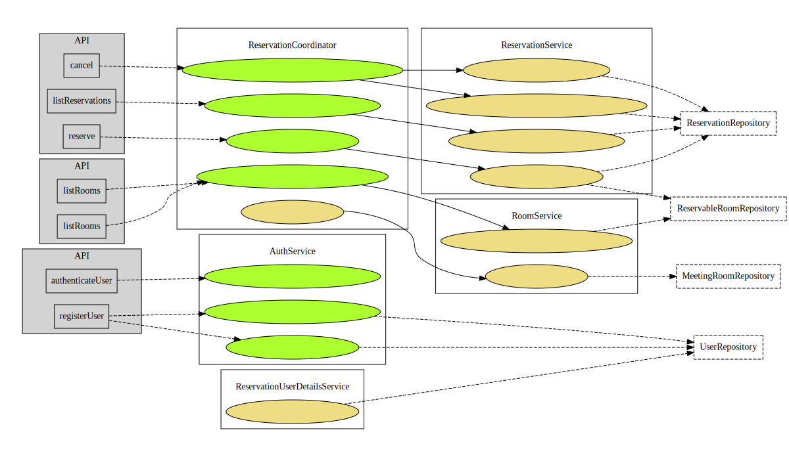

[](http://app-mrs.azurewebsites.net/)
[](https://dev.azure.com/k2works/Mrs)
[](https://dev.azure.com/k2works/mrs/_build/latest?definitionId=17&branchName=master)
[](https://dev.azure.com/k2works/mrs/_build/latest?definitionId=17&branchName=develop)
[](https://github.com/k2works/mrs)
[](https://dashboard.cypress.io/projects/qip2k6/runs)
[](https://dev.azure.com/k2works/3c318163-9bbf-485c-befa-255f12ace93d/_boards/board/t/8924d8db-611f-47cf-9540-b520ce3eb7d6/Microsoft.FeatureCategory/)
# MRS (Meeting room reservation system)

[](https://gitpod.io/#https://github.com/k2works/mrs)

## 概要

Spring 徹底入門 Spring Framework による Java アプリケーション開発 チュートリアルの実装例

実装にあたっては [CCSR手法](https://masuda220.hatenablog.com/entry/2020/05/27/103750) を参考にオリジナルをリファクタリングした。

### 目的

- SpringBootの学習
- CCSR手法の実践
- テスト駆動開発とリファクタリングの実践
- 継続的インテグレーションの実践

### 前提

| ソフトウェア | バージョン | 備考 |
| :----------- | :--------- | :--- |
| java         | 11         |      |
| SpringBoot   | 2.4.1      |      |
| Node.js      | 12.16.3    |      |

### Quick Start

```bash
./gradlew bootRun
```

アプリケーションは、http://localhost:8080 でログイン画面を表示できます。

APIドキュメントはログイン後に http://localhost:8080/swagger-ui.html から確認できます。

### アプリケーションの内容

会議室の予約とキャンセルを行うビジネスユースケース

- Webで会議室の予約を行う
- Webで会議室の予約をキャンセルする


- [ドキュメント](./docs/Requirement.md)

## 構成

- [構築](#構築)
- [配置](#配置)
- [開発](#開発)
- [運用](#運用)

### 構築

#### システム構成


- [ドキュメント](./docs/Build.md)

**[⬆ back to top](#構成)**

### 配置

- [ドキュメント](./docs/Ship.md)

**[⬆ back to top](#構成)**

### 開発

#### データモデル



#### アプリケーションアーキテクチャ


#### ドメインオブジェクトのモデル


#### 画面とユースケース



- [ドキュメント](./docs/Development.md)

**[⬆ back to top](#構成)**

### 運用

- [ドキュメント](./docs/Run.md)

**[⬆ back to top](#構成)**

## 参照

- [Spring 徹底入門 Spring Framework による Java アプリケーション開発](https://www.amazon.co.jp/dp/B01IEWNLBU/ref=dp-kindle-redirect?_encoding=UTF8&btkr=1)
- [JIG](https://github.com/dddjava/jig)
- [JIG-ERD](https://github.com/irof/jig-erd)
- [最新版TypeScript+webpack5の環境構築まとめ](https://ics.media/entry/16329/)
- [React-routerでルーティングを実装編](https://hirooooo-lab.com/development/react-redux-routing-by-react-router/)
- [React Redux: Token Authentication example with JWT & Axios](https://bezkoder.com/react-redux-jwt-auth/)
- [React Redux Login, Logout, Registration example with Hooks](https://bezkoder.com/react-hooks-redux-login-registration-example/)
