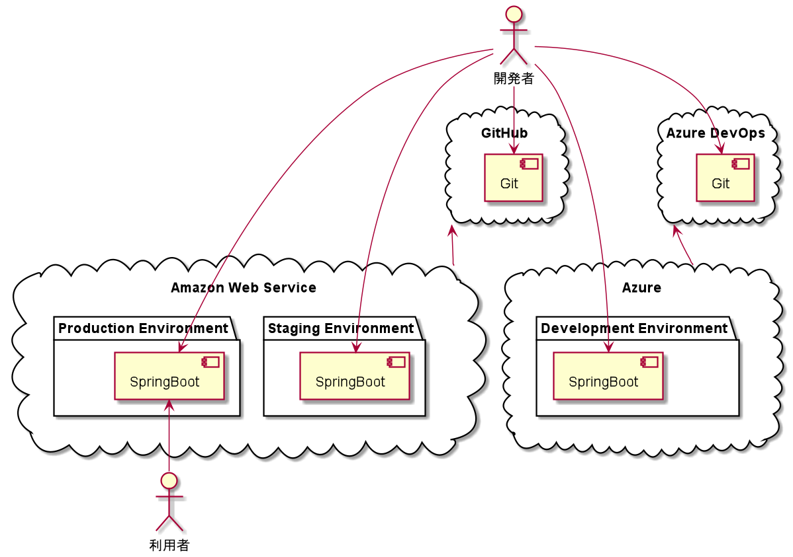

# 構築

## システム構成



## E2Eセットアップ

```
npm init -y
npm install --save-dev npm-run-all watch foreman cpx rimraf
npm install cypress
npm install --save-dev cypress-cucumber-preprocessor
npx cypress open
touch cypress/Procfile
```

## Webpackセットアップ

```
npm install --save-dev browser-sync jest @babel/core @babel/cli @babel/preset-env @babel/register
npm install webpack webpack-cli html-webpack-plugin webpack-serve --save-dev
npm install --save-dev style-loader css-loader
npm install --save-dev npm-run-all watch foreman cpx rimraf marked
```
