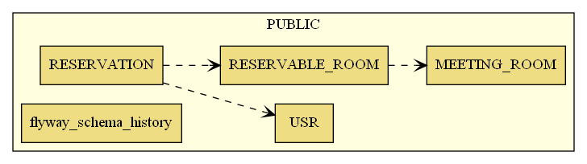
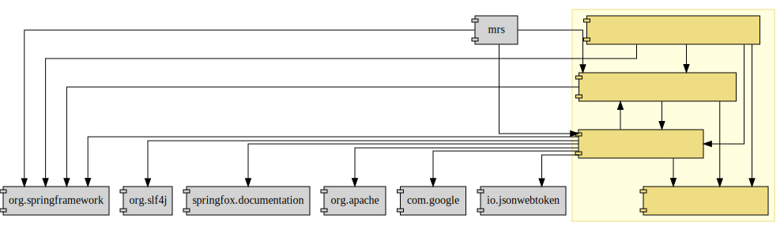
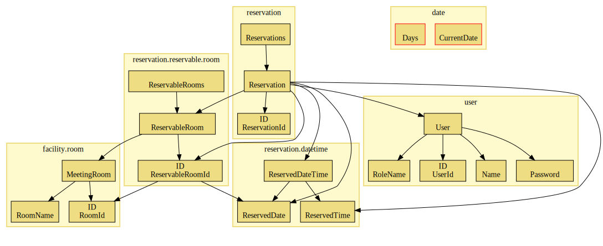
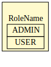
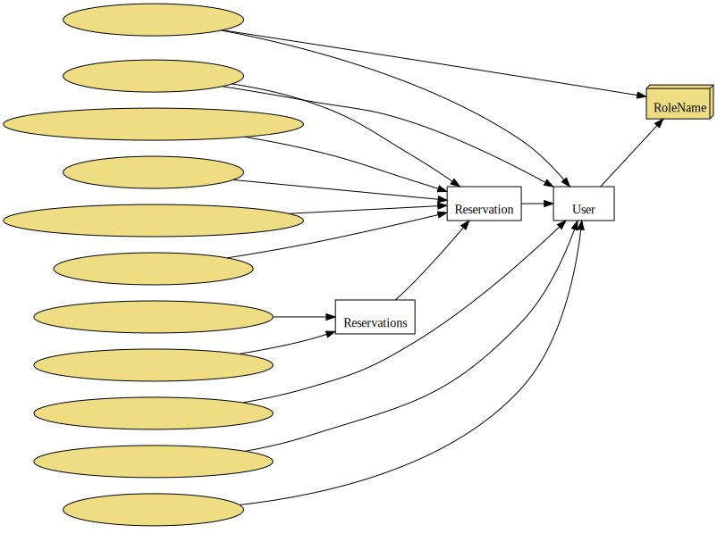
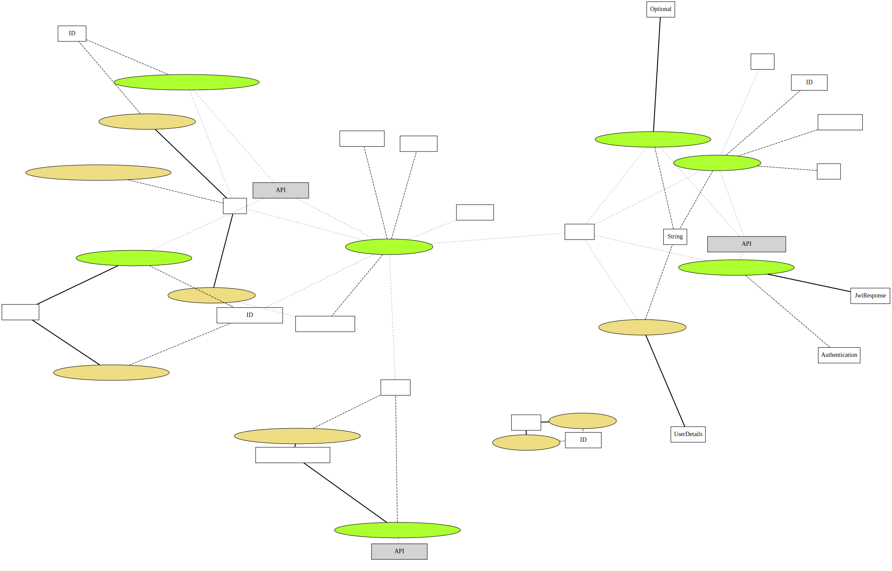
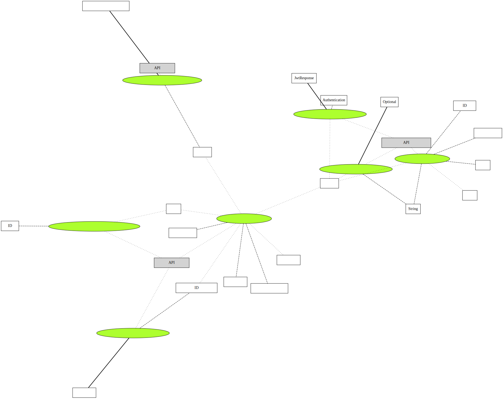
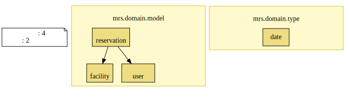
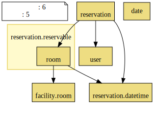

# 開発

## データモデル

### スキーマ

### サマリ

### 詳細

## ドメインモデル

### アーキテクチャ図

### 集中ビジネスツリー図

### ビジネスルール関連図

### 区分図

### 区分使用図

### ユースケース複合図

### ユースケース複合図

### パッケージ関連図

### パッケージ関連図

### パッケージ関連図

### サービスメソッド呼び出し図

