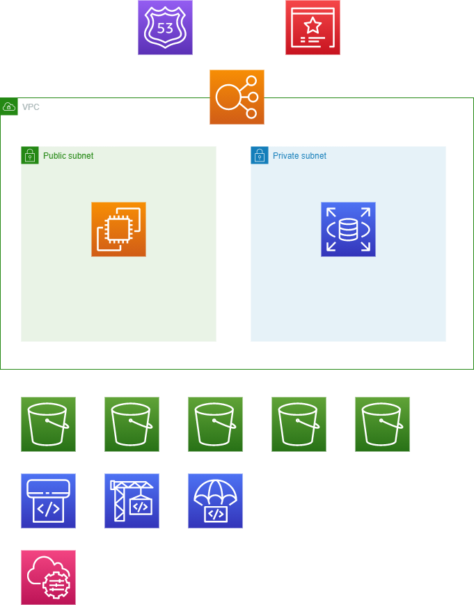
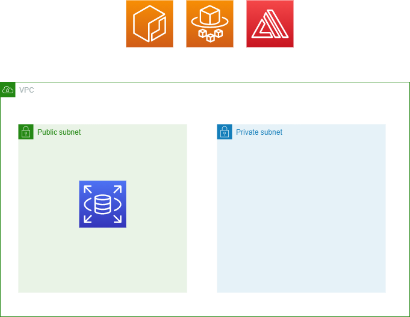

# インフラ

# 概要

## 目的

## 前提

# 構成

+ 概要
+ 構築
+ 配置
+ 運用

## 概要

## 構築

## セットアップ(WSL)

WSL環境構築に関しては以下を参照

- [環境構築から始めるテスト駆動開発 ~プログラミング環境の共通基盤を構築する~](https://k2works.github.io/2020/04/07/2020-04-08-1/)

[web.yml](ops/build/ansible/group_vars/docker.yml) の `user:` をWSLアカウントユーザーにする

```
./setup_wsl.sh
```

## セットアップ(AWS)

```
aws configure --profile k2works
aws s3 mb s3://mrs-org-mrs-production-tfstate --profile k2works
cd build/terraform
terraform init
terraform plan -var-file="secret.tfvars"
terraform apply -var-file="secret.tfvars"
```

## 配置

### Type1

```
cd build/terraform/type01
terraform init
terraform apply -var-file="secret.tfvars"
```



### Type2

```
cd build/terraform/type02
terraform init
terraform apply -var-file="secret.tfvars"
```


### Type3

```
cd build/terraform/type03
terraform init
terraform apply -var-file="secret.tfvars"
```


### Type4

```
cd build/terraform/type04
terraform init
terraform apply -var-file="secret.tfvars"
```



## 運用

### 環境を削除する

```
terraform destroy
```
